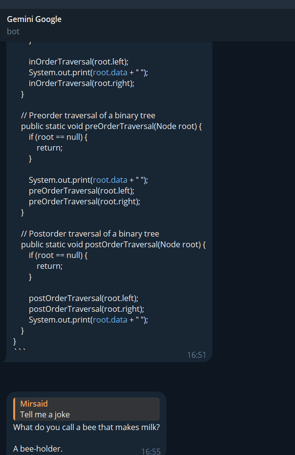
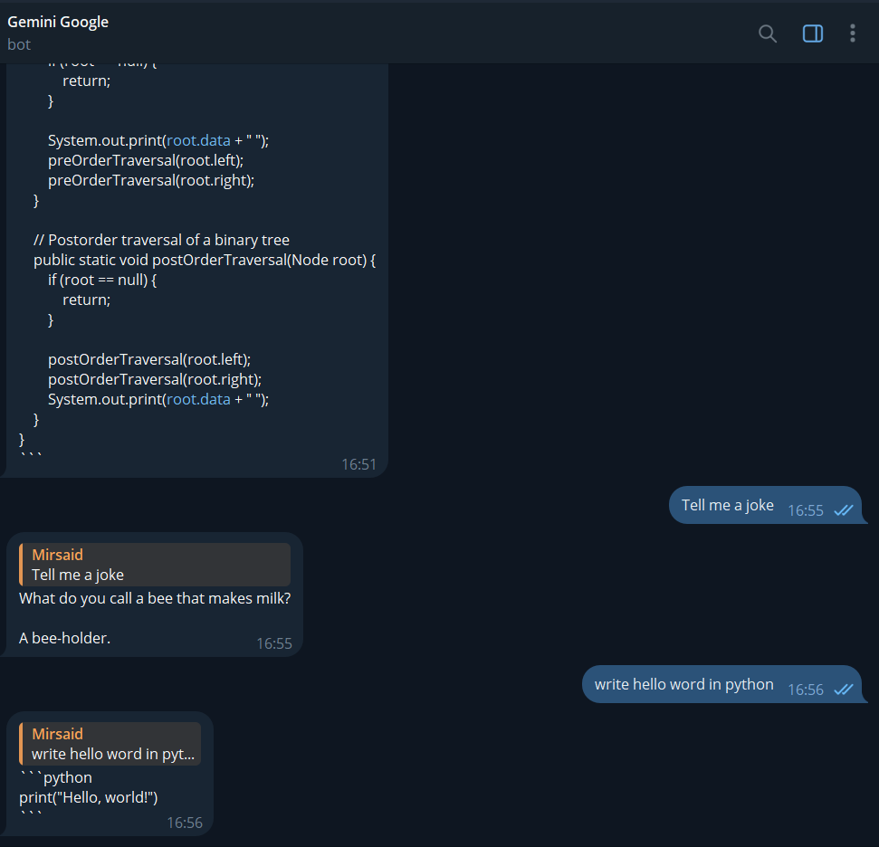

# Google Gemini LLM Telegram Bot with Vertex AI

Large Language Model Gemini deployed on Telegram Bot

[Watch the Demo](https://drive.google.com/file/d/1BNBAqx5BBB0EdT4g9d_e5lfNqdF25kVf/view?usp=sharing)
<video controls src="demo/demo_gemini.mp4" title="Demo"></video>

### Setup

1 Get Telegram API
2 Create a project on Vertex AI

```bash
# Clone the repository
git clone https://github.com/mirsaidl/GeminiLLM_TgBot.git

# Install required libraries
pip install -r requirements.txt
```

Before runnning app.py you should install Google SDK on your computer, login in terminal of SDK with your Google account for authentication. For more information go to the [Google Cloud Authentication](https://cloud.google.com/docs/authentication/provide-credentials-adc#how-to)

```bash
# Run Application
python app.py
```

### What can Gemini do?

* **Text Generation:** Create engaging and informative text, such as marketing copy, articles, and stories.
* **Text Summarization:** Condense large chunks of text into concise summaries.
* **Language Translation:** Translate text between over 100 languages.
* **Chatbots:** Build intelligent chatbots that can understand and respond to human language.
* **Named Entity Recognition:** Identify and extract entities like names, locations, and organizations from text.

### Preview





## Contributing

Contributions are welcome! If you encounter any bugs or have suggestions for new features, please open an issue or submit a pull request.


